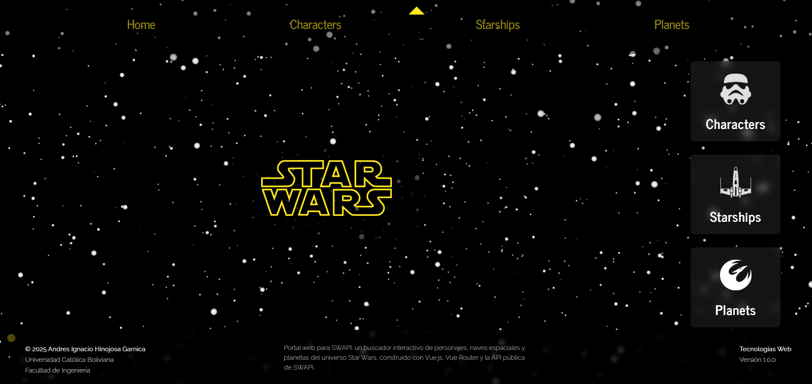
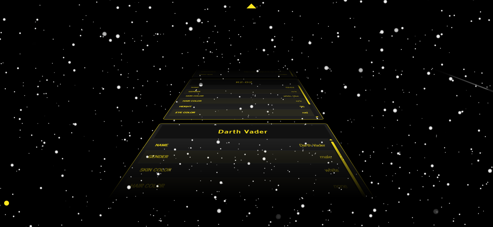
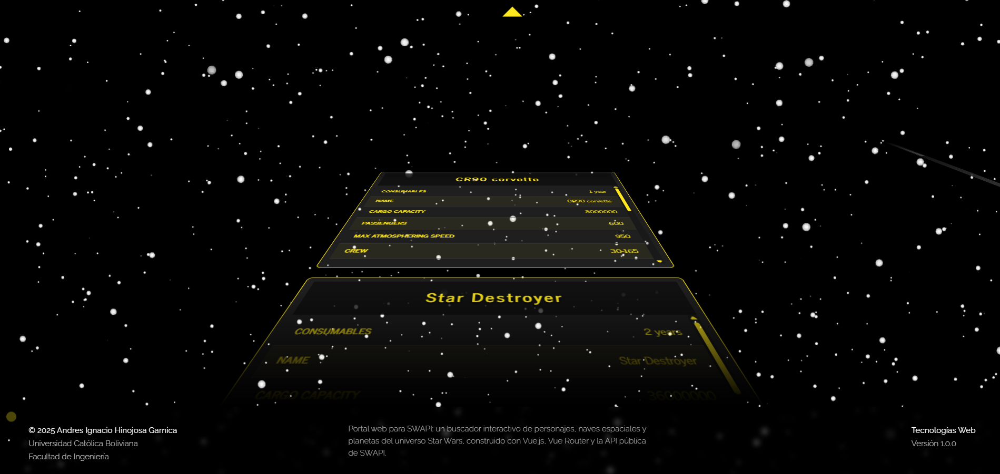
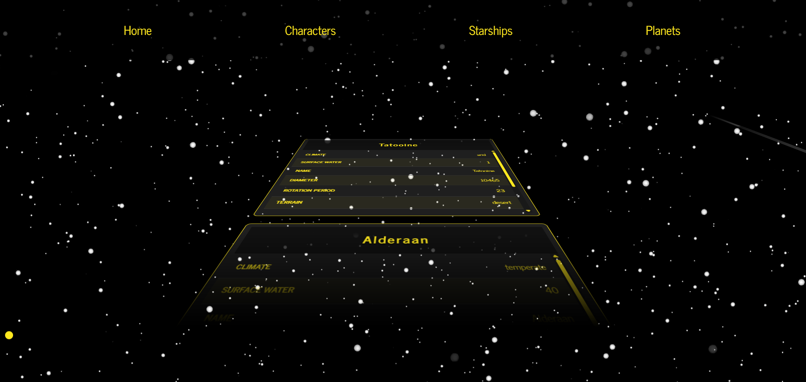

# Portal SWAPI


Portal web interactivo que consume la API pública de SWAPI para mostrar personajes, naves espaciales y planetas del universo Star Wars.

## Índice

- [Descripción](#descripción)
- [Instalación](#instalación)
- [Uso](#uso)
- [Capturas de pantalla](#capturas-de-pantalla)
- [ESLint](#eslint)
- [Licencia](#licencia)

## Descripción

Este proyecto es un **portal web para SWAPI**, un buscador interactivo de personajes, naves espaciales y planetas del universo Star Wars, construido con **Vue.js**, **Vue Router** y la **API pública de SWAPI**.

## Instalación

1. Clona el repositorio:
   ```bash
   git clone https://github.com/tu-usuario/tu-repositorio.git
   cd tu-repositorio

2. Abre el directorio
   ```
   cd ./frontend
   ```
3. Instala dependencias:
   ```bash
   npm install
   ```
4. Arranca el servidor de desarrollo:
   ```bash
   npm run dev
   ```

## Uso

- Accede a `/characters` para ver la lista de personajes.  
- Accede a `/starships` para ver la lista de naves espaciales.  
- Accede a `/planets` para ver la lista de planetas.

## Capturas de pantalla

### Inicio



### Personajes



### Naves espaciales



### Planetas



## ESLint

El proyecto incluye **ESLint** con configuración para Vue 3 y Prettier.  
Para ejecutar el lint manualmente:
```bash
npm run lint
```

Los errores de ESLint también se muestran al vuelo durante `npm run dev` mediante `vite-plugin-eslint`.

## Licencia

MIT © 2025 Andres Ignacio Hinojos Garnica

